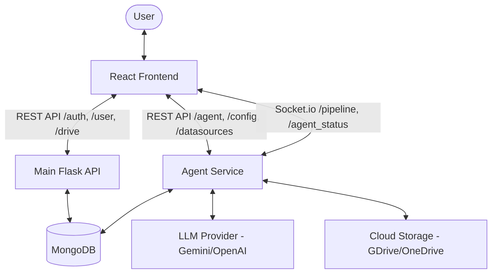

# Backend Communication Documentation

This document provides a comprehensive guide to the communication between the Elinara Lab frontend and its backend services (Main API and Agent API).

## 1. Architecture Overview



## 2. Global Configuration

The frontend uses two primary base URLs:
- **`VITE_API_BASE_URL`**: Target for the Main Backend API (e.g., `/api/v1`).
- **`VITE_AGENT_BASE_URL`**: Target for the standalone Agent Service.

### 2.1 Security & Authentication
- **HttpOnly Cookies**: All sensitive tokens (JWT) are stored in `HttpOnly`, `Secure`, `SameSite=Strict` cookies.
- **`withCredentials: true`**: Configured in all `axios` instances to ensure cookies are sent.
- **CSRF Protection**: Double-submit cookie pattern. The backend sets a `csrf_access_token` cookie, which the frontend sends back in the `X-CSRF-Token` header for state-changing requests (POST, PUT, DELETE).

---

## 3. REST API Reference

### 3.1 Authentication Services (`authService`)
Base: `VITE_API_BASE_URL`

| Endpoint | Method | Description |
| :--- | :--- | :--- |
| `/auth/login` | `POST` | Authenticate user with username/password. |
| `/auth/logout` | `POST` | Clear session cookies. |
| `/auth/disconnect/{provider}` | `POST` | Disconnect Google or Microsoft provider. |
| `/user/register` | `POST` | Register a new user. |
| `/auth2/github/signin` | `GET` | Redirect to GitHub OAuth sign-in. |
| `/auth2/github/logout` | `POST` | Logout from GitHub provider. |
| `/auth2/microsoft/login` | `GET` | Redirect to Microsoft OAuth sign-in. |

#### Auth Request Examples
**Login POST `/auth/login`**
```json
{
  "username": "user123",
  "password": "securepassword"
}
```

---

### 3.2 User Management (`userService`)
Base: `VITE_API_BASE_URL`

| Endpoint | Method | Description |
| :--- | :--- | :--- |
| `/admin/user` | `GET` | Get current authenticated user details. |
| `/user/dao` | `POST` | Register/Create user data. |
| `/user/dao/{id}` | `GET` | Retrieve specific user by ID. |
| `/user/dao/{id}` | `PUT` | Update user profile. |
| `/user/dao/{id}` | `DELETE` | Delete user account. |
| `/user/export` | `GET` | Export user data (JSON file). |
| `/user/manager` | `GET` | (Admin) List all users. |

---

### 3.3 Cloud Storage Service (`driveService`, `oneDriveService`)
Base: `VITE_API_BASE_URL`

| Endpoint | Method | Description |
| :--- | :--- | :--- |
| `/drive/files` | `GET` | List Google Drive files/folders. |
| `/drive/file/{id}` | `GET` | Get metadata for a specific Google Drive file. |
| `/drive/microsoft/files` | `GET` | List OneDrive files/folders. |
| `/drive/microsoft/file/{id}` | `GET` | Get metadata for a specific OneDrive file. |
| `/cloud/files` | `GET` | Aggregated view of all connected cloud files. |
| `/cloud-files` | `GET` | List files saved to the agent context. |
| `/cloud-files` | `POST` | Save cloud files to the agent context. |

**Query Params for `listFiles`**: `?folder_id={id}` (optional)

---

### 3.4 Agent Management (`agentService`)
Base: `VITE_AGENT_BASE_URL`

| Endpoint | Method | Description |
| :--- | :--- | :--- |
| `/agent/status` | `GET` | Get current status of the AI agent. |
| `/agent/control` | `POST` | Start, stop, or pause the agent. |
| `/agent/config` | `POST` | Update agent LLM model. |
| `/agent/task` | `POST` | Trigger a manual matching task. |
| `/agent/task/{id}` | `GET` | Get status of a specific background task. |
| `/agent/matches` | `GET` | Retrieve list of successful matches. |

**Control Request Body (`/agent/control`)**
```json
{
  "action": "start",
  "agent_id": "123",
  "execution_mode": "manual"
}
```

---

### 3.5 Process & DataSource Management
Base: `VITE_API_BASE_URL` (Processes) & `VITE_AGENT_BASE_URL` (DataSources)

#### Processes
| Endpoint | Method | Description |
| :--- | :--- | :--- |
| `/admin/processes` | `GET` | List all agent processes. |
| `/admin/processes` | `POST` | Create a new process (agent instance). |
| `/admin/processes/{id}` | `GET/PUT/DELETE` | CRUD for a specific process. |

#### Configuration
| Endpoint | Method | Description |
| :--- | :--- | :--- |
| `/config/update` | `GET` | Retrieve agent configuration (optionally by `agent_id`). |
| `/config/update` | `POST` | Update agent configuration including emails and scheduling. |
| `/config/connection-emails` | `GET/POST` | (Legacy) Manage connection alert emails. |

#### DataSources
| Endpoint | Method | Description |
| :--- | :--- | :--- |
| `/datasources` | `GET` | List data sources (optionally by `process_id`). |
| `/user/datasources` | `GET` | List all data sources for the current user. |
| `/datasources` | `POST` | Create one or more data sources (Bulk supported). |
| `/datasources/{id}` | `GET/PUT/DELETE` | CRUD for a specific data source. |
| `/datasources` | `DELETE` | Bulk delete data sources (passing IDs in body). |

---

## 4. Real-time Communication (Socket.io)

The application uses Socket.io for real-time monitoring of agent execution.

- **URL**: `VITE_AGENT_BASE_URL` (stripped of `/api` if present)
- **Path**: `/api/socket.io`
- **Transport**: Websocket / Polling

### 4.1 Client Emitted Events
- `join`: Join a room for targeted updates. Payload: `{"room": "agent_{id}"}` or `{"room": "user_{id}"}`.
- `leave`: Leave a room. Payload: `{"room": "agent_{id}"}` or `{"room": "user_{id}"}`.

### 4.2 Server Emitted Events

| Event Name | Payload Structure | Description |
| :--- | :--- | :--- |
| `agent_status` | `{"agent_id": "...", "status": "active/stopped"}` | Update on agent running state. |
| `pipeline_update` | `{"process_id": "...", "pipeline": { ... }}` | Granular progress for each ELT stage. |
| `agent_countdown` | `{"process_id": "...", "remaining_seconds": N}` | Time until next scheduled run. |
| `task_update` | `AgentTask` object | Status of a specific background processing task. |
| `agent_action` | `{"id": "...", "type": "thought/action", "content": "..."}` | Real-time "thought stream" from the LLM. |

---

## 5. Standard Data Objects

### 5.1 DataSource
```json
{
  "id": "mongo_id_string",
  "process_id": "agent_id_string",
  "platform": "google_drive", 
  "resource_identifier": "folder_id_or_api_name",
  "resource_name": "Friendly Name",
  "config": []
}
```

### 5.2 AgentTask
```json
{
  "id": "uuid",
  "status": "queued | processing | completed | failed",
  "progress": 0-100,
  "filename": "Leads.xlsx",
  "phone": "+351...",
  "created_at": "ISO8601"
}
```
